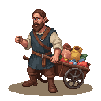
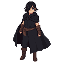

# The Smith's Forge: An Introduction to Kalev

**Game Scene:** `forge.tscn`

### Music
- **Rhythmic, Industrial, Brooding:** Anvil strikes, bellows whoosh, grinding metal, low male choir, heavy percussion.
- **Tense, Confrontational, Resentful:** Sharp string accents, deep brass drones, pulsing timpani, distorted lute, aggressive male vocals.
- **Solitary, Reflective, Determined:** Solo cello melody, ambient synth pads, slow piano chords, echoing hammer blows, a single, sustained violin note.
- **Uprising, Hopeful, Rebellious:** Driving string ostinato, powerful brass fanfare, soaring female vocals, military snare drum rhythm, layered choir.
- **Mysterious, Secretive, Dangerous:** Pizzicato strings, woodwind whispers, soft, dissonant piano clusters, low, rumbling percussion, a lone flute melody.

---

## Factions Present

### The Black Cloaks 🌃
The forge is the central hub for the Black Cloaks.

## NPCs

**Lembit Helme**: A charismatic blacksmith with a powerful build, often seen with a hammer in hand. He has a determined look, a thick beard, and eyes that burn with rebellious fire.

**Old Man Toomas**: A retired blacksmith who sometimes helps out at the forge. He is thin and wiry, with a kind, wrinkled face and hands gnarled from a lifetime of work.

**Young Apprentice Juhan**: A boy of about 15, eager to learn the blacksmithing trade. He is scrawny but strong, with a perpetually soot-smudged face and a hopeful expression.

**Town Guard Captain**: A stern, well-built man in his late 30s, wearing a polished helmet and a chainmail shirt. He has a neatly trimmed beard and a suspicious gaze.

**Wealthy Merchant's Wife**: A finely dressed woman who comes to the forge to order custom ironwork for her home. She wears a silk dress and a disdainful expression.

**Farmer with a Broken Plow**: A man in simple, earth-stained clothes, holding a broken plowshare. He has a worried look and a sun-beaten face.

**Mysterious Woman in a Black Cloak**: A woman who visits the forge at night, her face hidden by a deep hood. She speaks in whispers and carries a concealed dagger.

**Gossip-Mongering Neighbor**: An old woman who lives next to the forge and seems to know everyone's business. She has a sharp nose and even sharper eyes.

**Child with a Toy Sword**: A young boy who idolizes the blacksmith and often plays with a wooden sword near the forge. He has a mop of blond hair and a cheerful grin.

**Traveling Peddler**: A man with a cart full of odds and ends, trying to sell his wares to the blacksmith. He has a glib tongue and a shifty gaze.

**Disgruntled Farmer**: A man in his 40s, with a weathered face and a permanent scowl. He complains about the high price of iron and the low price of grain.

**Priest's Emissary**: A young man in a simple robe, sent by the local priest to commission a new set of iron gates for the church. He is soft-spoken and avoids eye contact.

**Livonian Order Squire**: A young nobleman in training, sent to the forge to have his master's horse shod. He is arrogant and impatient.

**Runaway Serf**: A young man with a haunted look in his eyes, seeking refuge at the forge. He is thin and wears ragged clothes.

**Black Cloak Scout**: A wiry, agile woman who moves with a cat-like grace. She has short-cropped dark hair and a network of scars on her arms.

**Black Cloak Strategist**: An older man with a scholarly air, often seen poring over maps and diagrams. He has a long, grey beard and wears spectacles.

**Black Cloak Forger**: A skilled artisan who specializes in creating false documents and seals. He has nimble fingers and a perpetually ink-stained thumb.

**Black Cloak Healer**: A woman with a gentle touch and a deep knowledge of herbs and remedies. She has a calm demeanor and kind eyes.

**Black Cloak Weapons Master**: A veteran warrior who trains the other members in the art of combat. He is scarred and grizzled, but his movements are still swift and deadly.

**The Mute Harpist**: A mysterious figure with silver eyes, dressed in black rags, with a bone ring on every finger. He carries a harp slung over his back and communicates through his haunting melodies.
