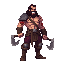
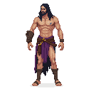
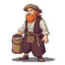

# Reval Harbor

**Game Scene:** `harbor.tscn`

The lifeblood of the city's trade, the harbor is a chaotic mix of sailors, merchants, city guards, and smugglers. It is a place of opportunity and danger, where valuable goods arrive and depart, and where several factions compete for control of the flow of goods.

## Factions Present

### The Hanseatic League 🇪🇺
The League dominates the official trade in the harbor, with their warehouses and offices lining the docks.

### The Vitalienbrüder 🏴‍☠️
The pirates have a strong, often clandestine, presence here, recruiting sailors, fencing stolen goods, and planning raids.
-   **Core NPC:** **"Ironhand" Störtebeker**, a grizzled and pragmatic pirate captain, can often be found in the harbor's taverns or back alleys.

**Character Art:**

### The Black Cloaks 🌃
The urban rebels use the harbor for smuggling weapons and supplies, and for making contact with sympathetic sailors.

## Other Characters

The harbor is populated by a variety of NPCs, reflecting its role as a cultural melting pot.

**Character Art:**
 

