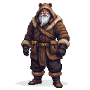

# Reval Harbor

**Game Scene:** `harbor.tscn`

The lifeblood of the city's trade, the harbor is a chaotic mix of sailors, merchants, city guards, and smugglers. It is a place of opportunity and danger, where valuable goods arrive and depart, and where several factions compete for control of the flow of goods.

## Factions Present

### The Hanseatic League 🇪🇺
The League dominates the official trade in the harbor, with their warehouses and offices lining the docks.

### The Vitalienbrüder 🏴‍☠️
The pirates have a strong, often clandestine, presence here, recruiting sailors, fencing stolen goods, and planning raids.
-   **Core NPC:** **"Ironhand" Störtebeker**, a grizzled and pragmatic pirate captain, can often be found in the harbor's taverns or back alleys.

**Character Art:**

### The Black Cloaks 🌃
The urban rebels use the harbor for smuggling weapons and supplies, and for making contact with sympathetic sailors.

## Other Characters

The harbor is populated by a variety of NPCs, reflecting its role as a cultural melting pot.

**Character Art:**
 

## NPCs

1.  **"Ironhand" Störtebeker**: A grizzled pirate captain with a prosthetic iron hand, a braided beard, and a patched-up eye. He wears a long leather coat and a confident smirk.
2.  **Hanseatic League Clerk**: A prim and proper man in his late 20s, with a neat haircut and a perpetually worried expression. He carries a ledger and a quill pen.
3.  **Weathered Estonian Fishwife**: An old woman with a wrinkled, sun-beaten face and seaweed tangled in her greying braids. Her hands are red and raw from the cold water.
4.  **Russian Fur Trader**: A large, bearded man dressed in layered pelts and a bearskin hat with earflaps. His belt is heavy with pouches, and his breath mists in the cold air.
5.  **Drunken Sailor from Lübeck**: A young man with a thick German accent, singing a bawdy sea shanty. He has a tattoo of a mermaid on his arm and a tankard of ale in his hand.
6.  **City Guard on Patrol**: A bored-looking guard in a dented helmet and a chainmail shirt, leaning on his spear and watching the ships come and go.
7.  **Smuggler's Lookout**: A young boy perched on a rooftop, keeping a watchful eye out for the city guard. He has a slingshot tucked into his belt.
8.  **Ship's Carpenter**: A man with a muscular build and a friendly, open face, carrying a set of well-used tools. He smells of sawdust and tar.
9.  **Seagull-Feeding Old Man**: A gentle old man who spends his days on the docks, feeding scraps of bread to the seagulls. He has a long white beard and a peaceful smile.
10. **Foreign Merchant from Novgorod**: A man with sharp, intelligent eyes and a long, flowing robe. He speaks with a thick accent and is always looking for a good deal.
11. **Fishmonger's Wife**: A stout woman with a booming voice, gutting fish with a practiced hand. She wears a blood-stained apron and a no-nonsense expression.
12. **Rat Catcher with a Terrier**: A wiry man with a ferret-like face, accompanied by a small, feisty terrier that darts in and out of the shadows.
13. **Press-Ganged Youth**: A young man with a terrified look in his eyes, being dragged onto a ship by a group of rough-looking sailors.
14. **Harbor Master**: A portly, important-looking man with a neatly trimmed beard and a ledger under his arm. He barks orders at the dockworkers and collects fees from the ships.
15. **Sailor's Lass**: A pretty young woman with a flower in her hair, waiting on the docks for her lover's ship to return. She has a hopeful, anxious expression.
16. **Mendicant Friar**: A thin, barefoot man in a simple brown robe, begging for alms from the sailors and merchants. He has a serene, otherworldly expression.
17. **Ship's Cook**: A cheerful, one-legged man with a ladle in his hand and a parrot on his shoulder. He is missing several teeth and has a hearty laugh.
18. **Black Cloak Contact**: A man in a dark cloak, pretending to be a simple dockworker. He has a coded phrase ready for those who know what to ask.
19. **Hanseatic League Guard**: A well-armed and disciplined soldier in the employ of the Hanseatic League, standing guard in front of a warehouse. He has a cold, professional demeanor.
20. **Child Playing with a Toy Boat**: A small boy kneeling by the water's edge, sailing a crudely carved wooden boat. He is oblivious to the chaos and danger around him.
