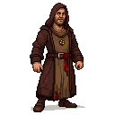
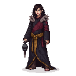
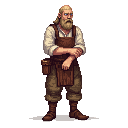
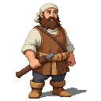
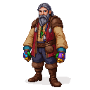
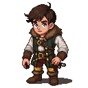
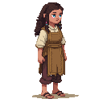
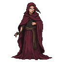
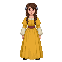
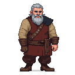

# Reval Market

**Game Scene:** `market.tscn`

The market is a vibrant, crowded space where goods from all over the known world are bought and sold. It is a place for commerce, but also for espionage, as it is a primary hub for the Pskovian agents operating in the city.

## Factions Present

### The Republic of Novgorod & Pskov 🌞
The market is the main area of operation for Pskovian agents, who use the cover of trade to gather intelligence and recruit sympathizers.
-   **Core NPC:** **Михаил Коловрат**, a cunning Pskovian agent operating as a fur trapper. He can be found here, trading furs and secrets.

**Character Art:**

### The Black Cloaks 🌃
The rebels also frequent the market to gather information, spread dissent, and acquire supplies.

## Other Characters

The market is filled with various vendors, shoppers, and city dwellers.

**Character Art:**
_This is where art for generic market NPCs, like the vendors and shoppers from the `workers_quarter` and `peasants` folders, would be linked._

