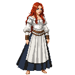

# St. Olaf's Guild Hall

**Game Scene:** `olaf_guild_hall.tscn`

The bustling social and economic hub for the merchants of Reval. Deals are struck, alliances are forged, and information is traded as freely as coin. It is a nexus of power for several factions vying for economic and political control.

## Factions Present

### The Hanseatic League 🇪🇺
This is the primary headquarters for the Hanseatic merchants in Reval.
-   **Core NPC:** **Jürgen von League**, a wealthy and ruthless amber merchant who unofficially speaks for the League. He can be found here, wheeling and dealing.

**Character Art:**

### The Republic of Novgorod & Pskov 🌞
The Novgorodian trade delegation uses the guild hall as a base of operations for their commercial activities in Reval.
-   **Core NPC:** **Яна Подаяльная**, the head of the Novgorodian trade delegation. A shrewd diplomat who can offer vast resources, but her support always comes at a steep price.

**Character Art:**

### The Brotherhood of Blackheads
The Brotherhood conducts much of its public-facing business here, maintaining a veneer of legitimacy.
-   **Core NPC:** **Johann von Minden**, the charismatic and ambitious leader of the Brotherhood of Blackheads. He is a master of public relations and a shrewd negotiator.

**Character Art:**

