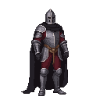

# The Smith's Forge

**Game Scene:** `forge.tscn`

This is Kalev's home and workshop. By day, it's a legitimate business where the player can craft items, fulfill orders, and interact with the townsfolk. By night, it serves as a secret headquarters for the Black Cloaks, the urban rebel faction.

## Factions Present

### The Black Cloaks 🌃
The forge is the central hub for the Black Cloaks.
-   **Core NPC:** **Lembit Helme**, a charismatic and impulsive blacksmith who has become the reluctant leader of the Reval uprising. He is a man of action, not words, and he offers you a place at the heart of the rebellion.

**Character Art:**

