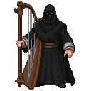

# The Smith's Forge: An Introduction to Kalev

**Game Scene:** `forge.tscn`

**Year:** 1342

**(The scene opens in a dimly lit, smoky forge. The air is thick with the smell of coal, hot metal, and sweat. The rhythmic clang of a hammer on an anvil is the only sound. KALEV, a man in his late 20s, stands before the anvil. He is bare-chested, his body lean but powerful, covered in a sheen of sweat and soot. His face is grim, his eyes focused, his movements precise and economical. He is working on a simple horseshoe, but he gives it the same attention he would a fine sword.)**

**(A young apprentice, JUHAN, about 15, works the bellows, his eyes fixed on Kalev with a mixture of admiration and fear.)**

**JUHAN**
(Timidly)
Master Kalev... the fire... it's hot enough.

**(Kalev doesn't answer. He finishes shaping the horseshoe, his hammer blows ringing with a final, satisfying clarity. He plunges the glowing metal into a trough of water, and the forge is filled with a hiss of steam.)**

**KALEV**
(Wiping his brow with the back of his hand)
It is always hot enough, Juhan. The question is, are you?

**(Before Juhan can answer, the door to the forge creaks open, and a wealthy HANSEATIC MERCHANT, dressed in fine wools and furs, steps inside. He wrinkles his nose at the smell.)**

**MERCHANT**
(In a haughty tone)
Smith! I have an order. I need a new set of hinges for my strongbox. The old ones are... insufficient.

**(Kalev turns slowly, his eyes lingering on the merchant's soft hands and well-fed belly. He says nothing.)**

**MERCHANT**
(Impatiently)
Well? Can you do it? I need them by tomorrow. I will pay you... five shillings.

**(Kalev picks up a heavy hammer, testing its weight in his hand. He looks from the hammer to the merchant, his expression unreadable.)**

**KALEV**
(His voice a low rumble)
The price of iron has gone up. The price of my time has gone up. Ten shillings.

**MERCHANT**
(Scoffing)
Ten shillings! That's robbery! I could get it done for half that in the upper town!

**KALEV**
Then go to the upper town.

**(Kalev turns back to his anvil, dismissing the merchant. The merchant sputters, his face turning red with anger. He is about to say something else, but then he sees the look in Kalev's eyes - a cold, hard glint that reminds him that this is not a man to be trifled with. He throws a small pouch of coins onto a nearby table.)**

**MERCHANT**
Fine! Ten shillings. But they had better be the best damn hinges in all of Reval.

**(The merchant storms out of the forge. Juhan looks at Kalev, his eyes wide.)**

**JUHAN**
Master Kalev... you shouldn't have...

**KALEV**
(Cutting him off)
He can afford it. And we have work to do.

**(Kalev picks up the pouch of coins and hands it to Juhan.)**

**KALEV**
Go. Buy us some bread and cheese. And a bottle of ale. The good stuff.

**(Juhan nods and scurries out of the forge. Kalev is left alone. He looks around his forge, at the tools of his trade, at the sweat and the soot. He picks up a piece of iron and holds it in the fire, his face illuminated by the glowing embers. The camera zooms in on his eyes, and for a moment, we see a flicker of the same fire that burned in his ancestor's eyes a century ago - a fire of defiance, of resentment, of a rebellion waiting to be born.)**

**(The scene fades to black.)**

---

## Factions Present

### The Black Cloaks 🌃
The forge is the central hub for the Black Cloaks.
-   **Core NPC:** **Lembit Helme**, a charismatic and impulsive blacksmith who has become the reluctant leader of the Reval uprising. He is a man of action, not words, and he offers you a place at the heart of the rebellion.

**Character Art:**

## NPCs

**Lembit Helme**: A charismatic blacksmith with a powerful build, often seen with a hammer in hand. He has a determined look, a thick beard, and eyes that burn with rebellious fire.

**Old Man Toomas**: A retired blacksmith who sometimes helps out at the forge. He is thin and wiry, with a kind, wrinkled face and hands gnarled from a lifetime of work.

**Young Apprentice Juhan**: A boy of about 15, eager to learn the blacksmithing trade. He is scrawny but strong, with a perpetually soot-smudged face and a hopeful expression.

**Town Guard Captain**: A stern, well-built man in his late 30s, wearing a polished helmet and a chainmail shirt. He has a neatly trimmed beard and a suspicious gaze.

**Wealthy Merchant's Wife**: A finely dressed woman who comes to the forge to order custom ironwork for her home. She wears a silk dress and a disdainful expression.

**Farmer with a Broken Plow**: A man in simple, earth-stained clothes, holding a broken plowshare. He has a worried look and a sun-beaten face.

**Mysterious Woman in a Black Cloak**: A woman who visits the forge at night, her face hidden by a deep hood. She speaks in whispers and carries a concealed dagger.

**Gossip-Mongering Neighbor**: An old woman who lives next to the forge and seems to know everyone's business. She has a sharp nose and even sharper eyes.

**Child with a Toy Sword**: A young boy who idolizes the blacksmith and often plays with a wooden sword near the forge. He has a mop of blond hair and a cheerful grin.

**Traveling Peddler**: A man with a cart full of odds and ends, trying to sell his wares to the blacksmith. He has a glib tongue and a shifty gaze.

**Disgruntled Farmer**: A man in his 40s, with a weathered face and a permanent scowl. He complains about the high price of iron and the low price of grain.

**Priest's Emissary**: A young man in a simple robe, sent by the local priest to commission a new set of iron gates for the church. He is soft-spoken and avoids eye contact.

**Livonian Order Squire**: A young nobleman in training, sent to the forge to have his master's horse shod. He is arrogant and impatient.

**Runaway Serf**: A young man with a haunted look in his eyes, seeking refuge at the forge. He is thin and wears ragged clothes.

**Black Cloak Scout**: A wiry, agile woman who moves with a cat-like grace. She has short-cropped dark hair and a network of scars on her arms.

**Black Cloak Strategist**: An older man with a scholarly air, often seen poring over maps and diagrams. He has a long, grey beard and wears spectacles.

**Black Cloak Forger**: A skilled artisan who specializes in creating false documents and seals. He has nimble fingers and a perpetually ink-stained thumb.

**Black Cloak Healer**: A woman with a gentle touch and a deep knowledge of herbs and remedies. She has a calm demeanor and kind eyes.

**Black Cloak Weapons Master**: A veteran warrior who trains the other members in the art of combat. He is scarred and grizzled, but his movements are still swift and deadly.

**The Mute Harpist**: A mysterious figure with silver eyes, dressed in black rags, with a bone ring on every finger. He carries a harp slung over his back and communicates through his haunting melodies.
