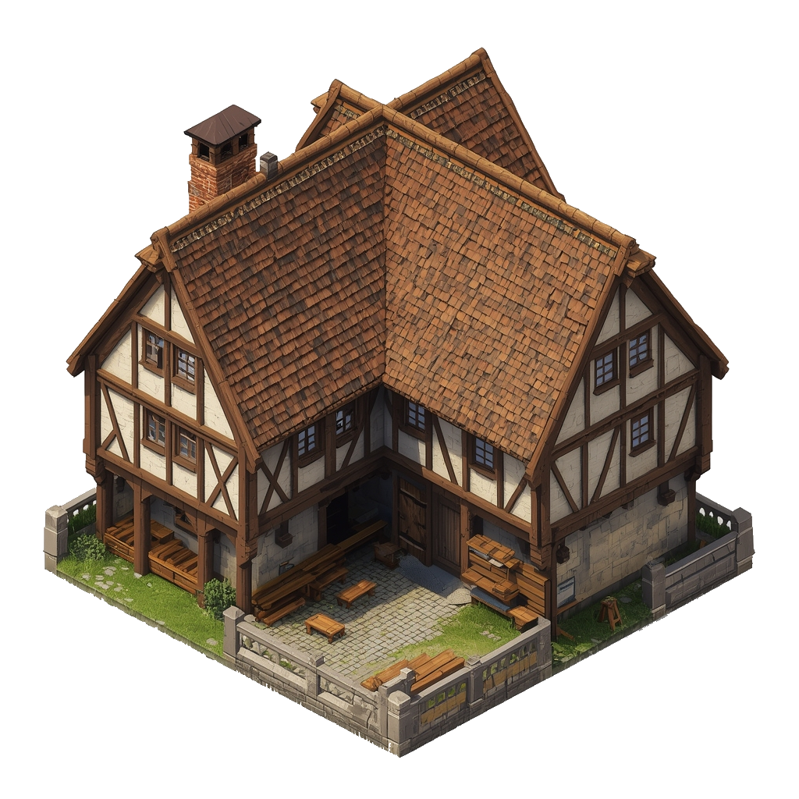

# Carpenter's Yard

A yard filled with lumber and sawdust, where furniture and building materials are crafted.

### Visual Description for Image Prompt

An isometric view of a carpenter's yard in medieval Tallinn (Reval), circa 1343. The yard is a large, open space, partially enclosed by a low stone wall. Stacks of lumber, logs, and finished planks are neatly arranged. A simple, open-sided shed with a shingled roof provides cover for a workbench and a collection of tools. Sawdust and wood shavings cover the ground. The scene is depicted in a historically accurate 14th-century Northern European style, with clear, crisp lines and no modern elements.

## What it's for

The Carpenter's Yard is the source of all things wooden in Reval. From the sturdy furniture that fills the homes of the city's residents to the timber frames of new buildings, the carpenters of this yard are essential for the growth and maintenance of the city. The air is thick with the scent of freshly cut wood, and the sounds of saws and hammers are a constant backdrop to the daily life of the quarter.

## Characters

- [Marek](../../characters/workers_quarter/marek/marek.md)
