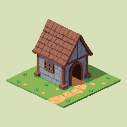

> **Legacy status:** `archive`  
> **Reason:** Speculative location design outside the approved vertical-slice scope.  
> **Current source of truth:** [`README.md`](../../README.md) - Vertical slice and scope boundaries; active prologue outline in [`docs/SCENES/the-makers-mark.md`](../../docs/SCENES/the-makers-mark.md).

# Simple Hut

A simple wooden hut, home to one of the poorer families in the quarter.
