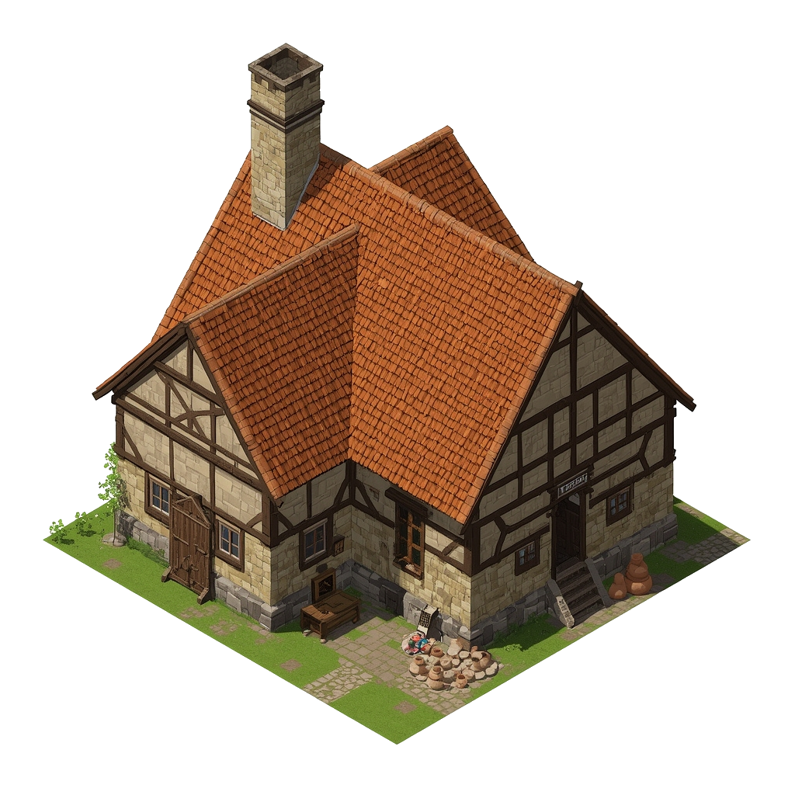

# Potter's Wheel Workshop

A small, dusty workshop where a family of potters creates simple, functional earthenware.

### Visual Description for Image Prompt

An isometric view of a single-story workshop in medieval Tallinn (Reval), circa 1343. The building is made of rough limestone with a thatched roof. A simple wooden sign with a clay pot painted on it hangs above the door. A large, open window reveals a potter's wheel and shelves filled with pottery. Stacks of firewood are piled against one of the walls. The building is located on a narrow, muddy lane.

## What it's for

The Potter's Wheel Workshop is where the humble, everyday earthenware of Reval is born. From simple bowls and jugs to storage jars and cooking pots, the pottery made here is essential for the daily life of the city's residents. The workshop is a family-run business, and the skills of the trade have been passed down through generations.

## Characters

- [Ingrid](../../characters/workers_quarter/ingrid/ingrid.md)
- [Peeter](../../characters/workers_quarter/peeter/peeter.md)
