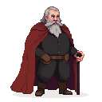
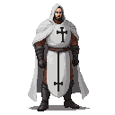
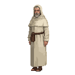
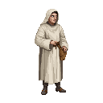

# Toompea Castle (Domberg)

**Game Scene:** `domberg.tscn`

Toompea Castle is the center of power in Reval, housing the main leadership of the ruling factions. It is a symbol of foreign domination and a primary target for rebel espionage and eventual assault.

## Factions Present

### The Danish Crown 🇩🇰 
Toompea is the seat of the Danish Viceroy, who governs the Duchy of Estonia.
-   **Core NPC:** **Viceroy Konrad Preen**, the Danish governor (capitaneus Revalie). A weary, aging diplomat who is more interested in securing a comfortable retirement than in governing effectively. He is pragmatic and can be bribed or persuaded, but his loyalty is ultimately to a distant king who has all but forgotten this northern outpost.

**Character Art:**

### The Livonian Order ✠ 
The Order maintains a strong military presence in the castle, using it as a barracks and command center.
-   **Core NPCs:** **Brother Burchard von Dreileben**, a zealous and battle-hardened knight of the Order. He is a formidable warrior and a charismatic leader, offering you access to elite combat training, blessed weaponry, and the chance to fight for what he believes is a righteous cause. He is unyielding in his faith and merciless to his enemies.

**Character Art:**

## NPCs

1.  **Viceroy Konrad Preen**: The aging Danish governor, with a weary face, a neatly trimmed grey beard, and fine but slightly worn clothing. He often looks distracted and tired.
2.  **Brother Burchard von Dreileben**: A zealous Livonian Order knight, with a scarred face, piercing blue eyes, and a powerful build. He is always in his immaculate white surcoat with the black cross.
3.  **Danish Noblewoman**: A young, beautiful woman in a fashionable gown, with an air of boredom and melancholy. She is the Viceroy's niece and feels trapped in this provincial outpost.
4.  **Livonian Order Sergeant**: A grizzled veteran with a broken nose and a gruff demeanor, responsible for training the castle's garrison.
5.  **Castle Scribe**: A stooped, balding man with ink-stained fingers, perpetually hunched over a desk and surrounded by scrolls and documents.
6.  **Kitchen Servant**: A young boy with a perpetually frightened expression, rushing through the castle corridors with trays of food.
7.  **Danish Courtier**: A foppish man in brightly colored silks, with a carefully coiffed beard and a talent for flattery and intrigue.
8.  **Livonian Order Chaplain**: A stern, ascetic priest who ministers to the spiritual needs of the knights. He has a thin, severe face and a disapproving gaze.
9.  **Castle Blacksmith**: A massive, muscular man with a bushy black beard and a leather apron, responsible for maintaining the castle's arms and armor.
10. **Stable Master**: A man with a weathered face and a no-nonsense attitude, who knows more about horses than he does about people.
11. **Visiting German Nobleman**: A wealthy and arrogant young man, visiting the Viceroy on a diplomatic mission. He looks down on the local customs and people.
12. **Estonian Servant Girl**: A young woman with a quiet, watchful demeanor, who understands more German than she lets on.
13. **Castle Guard**: A young, inexperienced soldier on his first tour of duty, looking nervous and out of place in his ill-fitting armor.
14. **The Viceroy's Personal Bodyguard**: A grim, silent man who never leaves the Viceroy's side. He has a reputation for being deadly with a sword.
15. **Torturer**: A hulking, brutish man with a shaved head and a cruel smile, who works in the castle dungeons.
16. **The Viceroy's Wife**: A proud, ambitious woman who is the real power behind the throne. She has a sharp tongue and a network of spies throughout the city.
17. **Livonian Order Novice**: A young, idealistic squire who is eager to prove his worth and earn his spurs as a knight.
18. **Castle Jester**: A small, nimble man in a colorful costume, who entertains the court with jokes, acrobatics, and surprisingly insightful political commentary.
19. **Black Cloak Spy**: A man disguised as a wine merchant, who uses his access to the castle to gather intelligence for the rebellion.
20. **The Ghost of a Danish King**: A spectral figure that is said to haunt the castle's ramparts on moonless nights, forever lamenting the loss of his kingdom.

## Night Enemies of Domberg

When darkness falls upon Toompea Castle, the ancient stones awaken with malevolent spirits and corrupted beings. These creatures emerge from the shadows, drawn by the castle's dark history of political intrigue, executions, and the lingering echoes of pagan curses that predate Christian dominion.

### 1. **Ööitketaja (Night Wailer)**
**Visual Description:** A gaunt, wraith-like figure wreathed in tattered burial shrouds, with sunken eyes that glow with pale blue fire. Its elongated fingers end in blackened nails, and wisps of spectral mist curl around its form. The creature's mouth hangs open in a perpetual silent scream, from which emanates an otherworldly wailing that chills the soul.

**Abilities:**
- **Mournful Wail**: Unleashes a piercing cry that causes fear and reduces the player's movement speed for 10 seconds
- **Soul Drain**: Touches the player to drain health slowly over time, manifesting as creeping despair
- **Phase Walk**: Can briefly become incorporeal to pass through walls and avoid attacks
- **Nightmare Whispers**: Inflicts confusion status, causing the player's controls to occasionally reverse

### 2. **Corrupted Danish Guard**
**Visual Description:** A former castle guard whose spirit has been twisted by years of witnessing political executions and betrayals. His chainmail is rusted and torn, revealing rotting flesh beneath. His face is a skull wrapped in decaying skin, with glowing red embers where eyes should be. He carries a spectral sword that flickers between solid steel and ethereal flame.

**Abilities:**
- **Spectral Slash**: Sword attacks that ignore armor but deal reduced damage
- **Loyalty's Curse**: Marks the player with a curse that attracts other undead enemies
- **Phantom Formation**: Summons ghostly allies for a brief coordinated attack
- **Undying Duty**: Resurrects once after being defeated, returning at half health

### 3. **Maa-alune (Underground Dweller)**
**Visual Description:** A gnome-like creature with pale, translucent skin and large, completely black eyes adapted to subterranean life. Its fingers are unnaturally long and end in sharp claws perfect for digging. Moss and fungi grow along its shoulders and back, and it wears crude armor crafted from bones and castle refuse. Its movements are quick and erratic, like a disturbed insect.

**Abilities:**
- **Tunnel Strike**: Burrows underground and emerges beneath the player for a surprise attack
- **Treasure Hoard**: Throws sharp objects and broken castle artifacts as projectiles
- **Cave-In**: Causes structural damage to nearby walls, creating temporary barriers or openings
- **Darkness Shroud**: Creates a zone of supernatural darkness that obscures vision

### 4. **Põrgukutsikas (Hell Hound)**
**Visual Description:** A massive, wolf-like creature with matted black fur that seems to absorb light. Its eyes burn like coals, and sulfurous smoke rises from its nostrils and between its fangs. Chains hang from its neck and legs, remnants of its binding to the castle's foundations. Its paws leave smoldering prints on stone, and its howl echoes with the screams of the tormented.

**Abilities:**
- **Hellfire Breath**: Breathes a cone of supernatural fire that deals damage over time
- **Pack Hunter**: Moves faster when other enemies are nearby
- **Chain Lash**: Uses its spectral chains to pull the player closer or trip them
- **Infernal Howl**: Summons additional lesser shadow creatures to the battle

### 5. **Vanapagan's Whisper**
**Visual Description:** A formless shadow that barely maintains a humanoid shape, constantly shifting and writhing like smoke. Occasionally, faces of the damned appear within its dark mass - nobles who sold their souls for power, corrupt priests, and traitorous knights. Red eyes flicker in and out of existence across its form, and it speaks in the voices of the castle's victims.

**Abilities:**
- **Soul Corruption**: Gradually drains the player's sanity/mana while in proximity
- **Voice of the Damned**: Mimics NPCs' voices to lure the player into traps
- **Shadow Bind**: Creates tentacles of darkness that temporarily immobilize the player
- **Possess**: Briefly takes control of the player's actions, forcing them to attack allies or move toward danger

## Music Prompts for Domberg

### Day Mode Tracks (5)

#### 1. "Crown of Stone"
**Prompt:** A stately processional piece featuring deep bronze bells, ceremonial drums, and a haunting solo kantele melody. The composition should evoke the weight of Danish authority and the castle's imposing presence. Layer in distant horn calls and the subtle creaking of castle gates. The tempo should be measured and dignified, with underlying tension suggesting the fragility of foreign rule.

#### 2. "Merchants' Whispers"
**Prompt:** A complex arrangement of plucked strings (kantele, small harps) with subtle percussion using wooden blocks and soft hide drums. Include the ambient sounds of quill pens scratching on parchment, coin purses jingling, and hushed conversations in German. The melody should weave between major and minor keys, reflecting the intricate political maneuvering within the castle walls.

#### 3. "Order's March"
**Prompt:** A martial composition dominated by military drums, bronze timpani, and the rhythmic clang of armor and weapons. Incorporate the sound of heavy boots on stone, chain mail rustling, and the distinct metallic ring of Livonian Order weaponry. A powerful brass melody should convey religious authority and military discipline, with undertones of foreign occupation.

#### 4. "Baltic Wind"
**Prompt:** An atmospheric piece built around the natural acoustics of stone courtyards and high walls. Feature wind instruments made from carved bone and wood, with the kantele providing a melancholic Estonian melody that seems to drift on the breeze. Include the actual sounds of wind through castle battlements, distant seagulls, and the subtle creaking of wooden structures.

#### 5. "Court of Shadows"
**Prompt:** A sophisticated chamber piece using period-appropriate strings and early woodwinds. The composition should reflect the tension between different factions within the castle - Danish nobles, German merchants, and Livonian knights. Use contrasting musical themes that interweave and occasionally clash, with underlying harmonies that suggest hidden agendas and political intrigue.

### Night Mode Tracks (5)

#### 1. "Ghosts of the Crown"
**Prompt:** A spectral arrangement featuring ethereal kantele arpeggios over deep, ominous drones created with low strings and ritual drums. Layer in the supernatural sounds of chains dragging across stone, distant moaning winds, and the echo of phantom footsteps in empty corridors. The melody should be haunting and melancholic, evoking the restless spirits of Danish royalty.

#### 2. "Midnight Executioner"
**Prompt:** A dark, rhythmic piece centered on the sound of an executioner's axe striking stone, transformed into a percussive element. Use low-pitched drums made from large animal hides, bone flutes playing dissonant melodies, and the ominous tolling of a distant bell. The composition should build tension through irregular rhythms that mirror a condemned man's final heartbeats.

#### 3. "The Wailer's Lament"
**Prompt:** Focus on the supernatural vocal qualities of the Ööitketaja - create a chilling soundscape using extended kantele techniques, bow strokes on metal strings, and ethereal vocal drones that seem to come from beyond the grave. Include the sound of wind through broken shutters, creaking wood, and the distant wail that gives the creature its name.

#### 4. "Bones Beneath Stone"
**Prompt:** A subterranean composition featuring percussion created from actual bones, stones scraping against each other, and the echo of water dripping in hidden chambers. The kantele should be played with unconventional techniques to create scratching, digging sounds. Build an atmosphere of things moving beneath the castle's foundations, with rhythms that suggest tunneling and burrowing.

#### 5. "Vanapagan's Dominion"
**Prompt:** The most intense and supernatural track, representing the Old Devil's influence over the corrupted castle. Use ritual drums in complex polyrhythms, distorted and reversed kantele melodies, and supernatural vocal elements that seem to whisper in forgotten languages. The composition should crescendo into chaos, representing the complete breakdown of order when ancient evil fully manifests within the castle walls.
