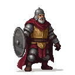
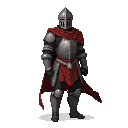

# Toompea Castle (Domberg)

**Game Scene:** `domberg.tscn`

Toompea Castle is the center of power in Reval, housing the main leadership of the ruling factions. It is a symbol of foreign domination and a primary target for rebel espionage and eventual assault.

## Factions Present

### The Danish Crown 🇩🇰 
Toompea is the seat of the Danish Viceroy, who governs the Duchy of Estonia.
-   **Core NPC:** **Viceroy Konrad Preen**, the Danish governor (capitaneus Revalie). A weary, aging diplomat who is more interested in securing a comfortable retirement than in governing effectively. He is pragmatic and can be bribed or persuaded, but his loyalty is ultimately to a distant king who has all but forgotten this northern outpost.

**Character Art:**

### The Livonian Order ✠ 
The Order maintains a strong military presence in the castle, using it as a barracks and command center.
-   **Core NPCs:** **Brother Burchard von Dreileben**, a zealous and battle-hardened knight of the Order. He is a formidable warrior and a charismatic leader, offering you access to elite combat training, blessed weaponry, and the chance to fight for what he believes is a righteous cause. He is unyielding in his faith and merciless to his enemies.

**Character Art:**

