# Harju Village

**Game Scene:** `harju_village.tscn`

A representative peasant village in Harju County, the heartland of the Estonian rebellion. These villages are the source of the Harju Kings' manpower and a focal point for the conflict in the countryside.

### The Harju Kings ✊🏻
This is the home turf of the rural rebels.

**Lembit Helme**: A stern village elder with a long white beard, a deeply wrinkled face, and eyes that have seen many winters. He carries a staff carved with ancient symbols.

**Kaja Lahekivi**: A nobleman's daughter turned rebel, with fiery red hair, a determined jaw, and practical leather clothing. She is skilled with a bow.

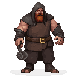
**Jüri Ratnik**: A former manor blacksmith, with a powerful build, a soot-stained face, and a quiet, thoughtful demeanor. He is a master of his craft.

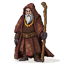
**Urmas Laar**: A mystic from the eastern marshlands, with wild, unkempt hair, a feverish look in his eyes, and clothes adorned with bones and feathers.

## Other Characters
The village is populated by peasants, farmers, and their families.

### Music
- **Pastoral, Folk, Communal:** Simple, melodic tunes played on traditional Estonian instruments (kannel, bagpipes, flute), with a sense of community and connection to the land.
- **Hopeful, Resilient, Determined:** A variation of the rebel anthem, but more intimate and personal, with a sense of quiet determination and the strength of a community united in a common cause.
- **Somber, Oppressed, Fearful:** A slow, mournful theme that reflects the hardships of peasant life under foreign rule, with a sense of ever-present danger and the fear of retribution.
- **Mysterious, Pagan, Ancient:** Music that hints at the survival of the old ways, with elements of shamanic drumming, chanting, and a sense of a deep, hidden magic in the landscape.
- **Sudden, Violent, Tragic:** The peaceful pastoral music is brutally interrupted by the sounds of an attack—dissonant brass, aggressive percussion, and a sense of chaos and terror.

**Character Art:**
_This is where art for generic peasant NPCs would be linked._

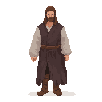
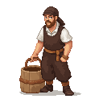
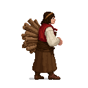
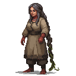
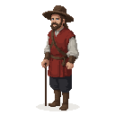

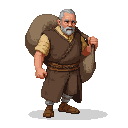
**Village Farmer**: A man with a sun-beaten face and strong, calloused hands, who works the fields from dawn till dusk.

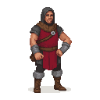
**Rebel Recruiter**: A man who travels from village to village, urging the peasants to join the uprising. He has a powerful, persuasive voice.

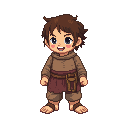
**Village Child**: A barefoot child with a dirty face and a mischievous grin

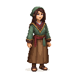
 **Wandering Healer**: A woman with a deep knowledge of herbs and folk remedies, who treats the sick and injured in the village.

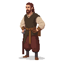
**Village Carpenter**: A skilled craftsman who builds and repairs the village's houses and furniture. He has a friendly, easygoing manner.

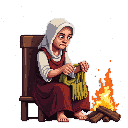
**Old Woman Spinning Wool**: A crone with gnarled hands, sitting by the fire and spinning wool into yarn. She seems to know all the village gossip.

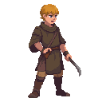
**Young Man Eager to Fight**: A teenager who is desperate to join the rebellion and prove himself a man. He has a boyish face and a fierce determination.

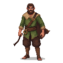
**Village Hunter**: A man who knows the forests and swamps like the back of his hand. He is lean and wiry, and moves with a silent grace.

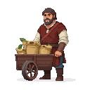
**Traveling Merchant**: A man with a cart full of goods, who brings news and supplies to the isolated village.

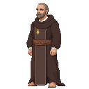
**Priest from a Nearby Parish**: A man who is torn between his loyalty to the Church and his sympathy for the plight of the peasants.

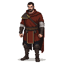
**Deserter from the Livonian Order**: A man who has fled the brutality of the Order and is hiding in the village. He is haunted by what he has seen and done.
