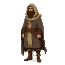
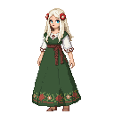
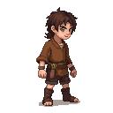
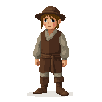
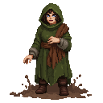

# The Sacred Grove

**Game Scene:** `sacred_grove.tscn`

A hidden, ancient grove deep in the forests outside Reval. This is a place of immense natural and supernatural power, sacred to the followers of the Old Ways. It is where the Cult of Metsik performs their rituals and communes with the spirits of the land.

## Factions Present

### The Cult of Metsik 🍀
This is the heart of the pagan cult's power.
-   **Core NPC:** **Ellen Luik**, the enigmatic high priestess of the cult. She is a powerful seer and a master of spirit magic, offering you access to ancient rituals, animal allies, and the raw, untamed power of the land itself.

**Character Art:**

### Music
- **Mystical, Magical, Otherworldly:** Ethereal choirs, shimmering synths, and traditional instruments like the kannel and flute create a sense of a world apart, a place of ancient magic and deep spiritual power.
- **Primal, Ritualistic, Dangerous:** Heavy, rhythmic drumming, guttural chanting, and the sounds of nature—wind, animal calls, rustling leaves—build to a frenzied, ecstatic climax.
- **Serene, Tranquil, Meditative:** The gentle sounds of a flowing stream, birdsong, and a simple, melodic theme for a solo instrument like a harp or a flute create a sense of peace and harmony with nature.
- **Dark, Corrupted, Sacrificial:** A dissonant, unsettling score with a heavy emphasis on low strings and percussion, a sense of a dark and ancient evil, and the sounds of a blood sacrifice.
- **Ancient, Wise, All-Knowing:** A slow, majestic theme with a sense of deep history and wisdom, featuring a lone, ancient-sounding voice and the use of traditional instruments in a sparse, minimalist arrangement.

## NPCs

1.  **Ellen Luik**: The high priestess of the Cult of Metsik, a woman with piercing green eyes, long, flowing white hair, and skin adorned with intricate, swirling tattoos. She wears a crown of antlers and robes made of moss and leaves.
2.  **The Grove's Guardian**: A massive, ancient bear that is the physical embodiment of the grove's spirit. It is fiercely protective of the area, but can be appeased with offerings.
3.  **A Young Woman Seeking a Vision**: A girl on the cusp of womanhood, who has come to the grove to perform a ritual and seek guidance from the spirits.
4.  **A Hunter Who Has Lost His Way**: A man who has stumbled into the grove by accident and is now terrified by the strange and supernatural things he has witnessed.
5.  **The Spirit of an Ancient Chieftain**: The ghost of a long-dead warrior who is buried in the grove. He can be a source of wisdom and power for those who show him respect.
6.  **A Coven of Witches**: A group of women who practice a darker, more bloodthirsty form of magic. They are rivals of the Cult of Metsik.
7.  **A Livonian Order Knight on a Secret Mission**: A knight who has been sent to spy on the cult and assess their strength. He is disguised as a traveler.
8.  **A Child Who Can Speak to Animals**: A young boy or girl who has a natural affinity for the creatures of the forest and can communicate with them.
9.  **The Hermit of the Grove**: An old man who has lived in the grove for decades, and has become one with the natural world. He is a source of great wisdom, but is difficult to find and even more difficult to understand.
10. **A Group of Pilgrims**: Followers of the Old Ways who have traveled from far and wide to pay their respects to the spirits of the grove.
11. **The Wood-Carver**: A man who carves intricate wooden idols of the gods and spirits of the grove.
12. **The Storyteller**: An old woman who knows all the ancient myths and legends of the grove, and who passes them on to the next generation.
13. **A Pair of Lovers Meeting in Secret**: A young man and woman from rival clans who use the grove as a secret meeting place.
14. **The Spirit of a Drowned Maiden**: The ghost of a young woman who drowned in the grove's sacred spring. She is a sorrowful and lonely figure.
15. **A Wild Boar**: A massive, aggressive boar that is a danger to anyone who wanders off the beaten path.
16. **The Altar of Sacrifice**: A large, flat stone that is used for offerings to the gods. It is stained with the blood of countless animals.
17. **A Circle of Standing Stones**: Ancient monoliths that are arranged in a circle, and which are said to be a source of great power.
18. **The Sacred Spring**: A pool of crystal-clear water that is said to have healing properties.
19. **The World Tree**: A massive, ancient oak tree that is at the center of the grove, and which is believed to be a connection between the worlds of the living and the dead.
20. **A Will-o'-the-Wisp**: A mysterious, flickering light that leads travelers astray in the forest.
