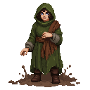

# The Sacred Grove

**Game Scene:** `sacred_grove.tscn`

A hidden, ancient grove deep in the forests outside Reval. This is a place of immense natural and supernatural power, sacred to the followers of the Old Ways. It is where the Cult of Metsik performs their rituals and communes with the spirits of the land.

## Factions Present

### The Cult of Metsik 🍀
This is the heart of the pagan cult's power.
-   **Core NPC:** **Ellen Luik**, the enigmatic high priestess of the cult. She is a powerful seer and a master of spirit magic, offering you access to ancient rituals, animal allies, and the raw, untamed power of the land itself.

**Character Art:**

