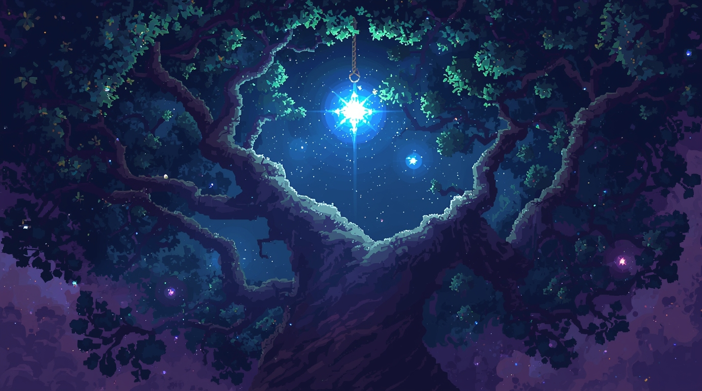

**Prompt:**
"Medieval blacksmith forge at night, 1340s Estonia. Kalev, a weathered 25-year-old Estonian man with shoulder-length dark brown hair, angular face with high cheekbones, and calloused scarred hands from years of smithing. He wears a leather apron over simple brown tunic, his muscular forearms visible. Cinematic lighting, historical accuracy, detailed textures

Medieval blacksmith forge at night, 1340s Estonia. Kalev, holds a hammer suspended over an anvil. He wears a leather apron over simple brown tunic, his muscular forearms visible. Broken iron blade on the anvil, split down the middle. Firelight from forge casts dramatic shadows on his weathered face, highlighting fierce green eyes filled with determination and suppressed anger. Through a small window behind him, silhouette of a Danish tax collector - tall, clean-shaven man in blue and red Danish colors with chainmail - taking coins from Henrik, an elderly Estonian peasant with gray beard, worn brown robes, and bent posture showing years of hardship. Workshop filled with traditional blacksmith tools, wood-beamed ceiling. Atmospheric smoke, warm orange firelight contrasting with cold blue moonlight from window. ."
## Scene 1: Kalev's Introduction - The Broken Blade
**Visual Style:** Dark, intimate, dramatic lighting
**Composition:** Close-up transitioning to medium shot

**Prompt:**
"Medieval blacksmith forge at night, 1340s Estonia. A weathered 25-year-old Estonian man (Kalev) with scarred hands holds a hammer suspended over an anvil. Broken iron blade on the anvil, split down the middle. Firelight from forge casts dramatic shadows on his angular face, highlighting determination and suppressed anger. Through a small window behind him, silhouette of Danish tax collector taking coins from an elderly peasant. Workshop filled with traditional blacksmith tools, leather apron, wood-beamed ceiling. Atmospheric smoke, warm orange firelight contrasting with cold blue moonlight from window. Cinematic lighting, historical accuracy, detailed textures."

## Scene 2: The Tax Collector's Cruelty - Henrik's Loss
**Visual Style:** Documentary realism, muted colors, oppressive atmosphere
**Composition:** Wide shot showing power dynamics

**Prompt:**
"Medieval Reval street scene, 1342. Elderly Estonian peasant (Henrik) with trembling hands giving his last silver coins to a stern Danish tax collector in chainmail and royal colors. Henrik's face shows desperation and grief - these coins meant for his daughter's dowry. Danish collector wears red and white Danish heraldry, confident and cold. Cobblestone street, timber-framed houses, other Estonian townspeople watching fearfully from doorways. Overcast sky, muted earth tones, realistic medieval clothing and architecture. Wide shot emphasizing the power imbalance, documentary-style lighting, autumn atmosphere in medieval Tallinn."

## Scene 3: Master and Apprentice - The Philosophy of Breaking
**Visual Style:** Warm interior lighting, teacher-student dynamic
**Composition:** Two-shot with emphasis on generational contrast

**Prompt:**
"Medieval blacksmith workshop interior, master craftsman and young apprentice. Kalev (25, weathered Estonian blacksmith) and 16-year-old Mart (nervous, eager apprentice) standing near forge. Kalev holds broken blade, speaking intensely while Mart listens with wide eyes. Workshop details: bellows, hammers, horseshoes, chain mail, glowing coals. Warm orange firelight, wooden beams, stone walls. Kalev's expression shows hidden rage beneath teaching facade. Mart's youthful concern contrasts with master's world-weariness. Oil painting style, Renaissance chiaroscuro lighting, rich textures, medieval craftsmanship tools surrounding them."

## Scene 4: Memory and Resistance - The Inherited Blade
**Visual Style:** Mystical, connecting past and present
**Composition:** Extreme close-up on hands and blade, symbolic lighting

**Prompt:**
"Extreme close-up of weathered Estonian hands engraving ancient symbols onto a blade by candlelight. The symbols match those from a sacred oak tree (subtle background suggestion). Kalev's scarred fingers trace runic Estonian markings - wolves, trees, ancient gods. Blade reflects flickering flame, creating dancing shadows. Single candle provides warm light, darkness surrounding. Tools for engraving, small hammer, medieval workshop atmosphere. Mystical quality suggesting ancestral connection, detailed metalwork, authentic medieval blade crafting. Macro photography style, dramatic lighting, spiritual undertones, connection between generations of resistance."

## Scene 5: The City of Occupation - Kalev's Walk Through Reval
**Visual Style:** Wide establishing shots, oppressive architecture
**Composition:** Following shot through medieval streets

**Prompt:**
"Medieval Reval (Tallinn) street scene, 1342. Estonian blacksmith walking through cobblestone streets past Danish guards and officials. Toompea castle looming in background, symbol of foreign rule. Timber-framed houses, church spires, bustling medieval market. Danish soldiers in chainmail with red shields, Estonian peasants and craftsmen in rougher clothing showing subtle deference and fear. Kalev moves with purpose but controlled anger, seeing every foreign symbol as occupation. Authentic medieval Baltic architecture, overcast skies, autumn light, detailed period costumes. Wide cinematic shot showing power structures through architecture and body language."

## Scene 6: The Forge's Secret Purpose - Banking the Fires
**Visual Style:** Conspiratorial, warm orange glow, building tension
**Composition:** Wide shot showing the full workshop transformation

**Prompt:**
"Medieval blacksmith workshop at dusk, fire being stoked higher than usual. Kalev and apprentice Mart preparing for night work, banking coals to white-hot intensity. Shadows dance on stone walls, tools laid out systematically - but these tools could forge weapons, not just horseshoes. Window shows approaching darkness over medieval Reval rooftops. Orange firelight spills from open doorway onto cobblestones. Atmosphere of secret preparation, resistance brewing. Other craftsmen's workshops visible in background, some with suspicious activity. Wide shot capturing the transition from day craft to night conspiracy. Dramatic lighting, medieval architecture, building sense of rebellion."

## Scene 7: The Weight of History - Kalev's Reflection
**Visual Style:** Introspective, connecting to ancestral memory
**Composition:** Medium shot with symbolic background elements

**Prompt:**
"Estonian blacksmith in contemplative pose, holding ancient blade with runic symbols. Kalev (25) sits on wooden stool in workshop, firelight illuminating his weathered face. Behind him, shadows on wall suggest shapes of sacred trees and ancient warriors. Small wooden figurine of Estonian god Taara visible on shelf. His expression shows weight of family legacy - 123 years of occupation, inherited resistance. Warm firelight contrasts with cold stone walls. Medieval workshop tools, leather apron, calloused hands. Atmospheric lighting suggesting spiritual connection to ancestors. Portrait-style composition, chiaroscuro lighting, emotional depth, historical continuity between past and present."

## Production Notes:
- **Color Palette:** Warm oranges and reds for forge scenes, cold blues for occupation scenes, earth tones for street scenes
- **Lighting:** Heavy use of practical lighting (fire, candles) for authenticity
- **Textures:** Emphasize worn leather, rough stone, beaten metal, weathered wood
- **Historical Details:** Accurate 14th century Estonian and Danish clothing, architecture, tools
- **Emotional Tone:** Building tension, suppressed anger, quiet resistance, generational burden
