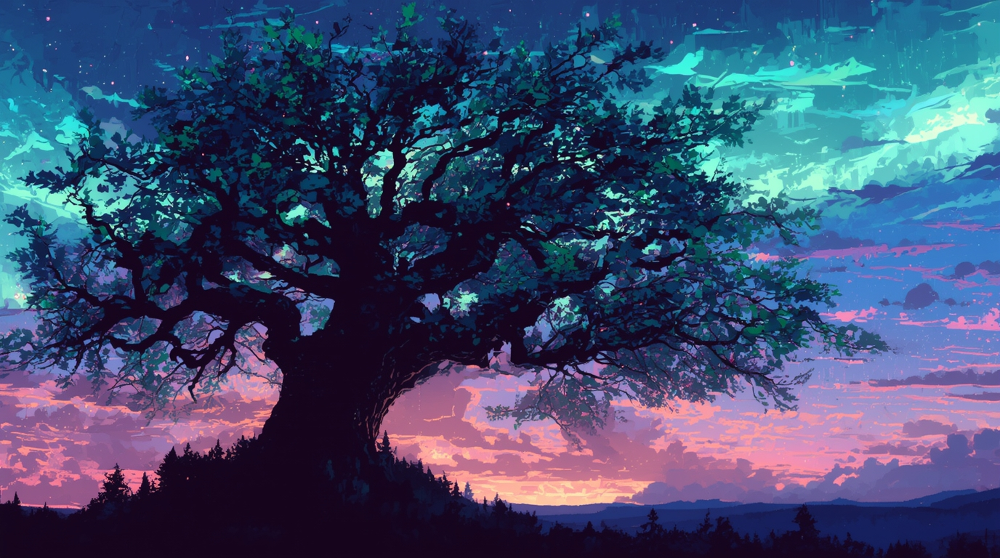
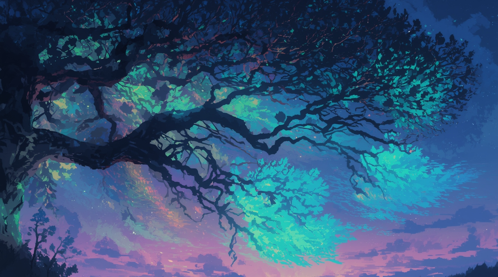

# Prequel Visual Prompts: The Forging of Chains (1219)

**Setting:** A sacred oak grove in Harju County, circa 1219. The air is thick with the smell of damp earth, moss, and the faint, sweet scent of burning offerings. An ancient, massive oak tree, its branches like gnarled arms reaching for the sky, stands at the center of a clearing. Carved wooden idols stand guard around it.

**(The scene opens with a wide shot of the sacred grove. The sun is setting, casting long, ominous shadows. The Volkhv is leading a ritual at the base of the great oak. Lembitu stands guard, his hand resting on the hilt of his sword. Aita watches from a safe distance, her eyes wide with a mixture of awe and fear.)**

**Characters:**

*   **Lembitu**, a chieftain of the Sakala people and an ancestor of Kalev. He is a powerful man in his prime, with a long, braided beard and eyes that burn with a fierce, protective fire. He wears a wolf-pelt cloak over his leather armor.
*   **Aita**, Lembitu's young daughter, about ten years old. She has her father's fiery spirit but her mother's gentle heart.
*   **The Volkhv**, an old pagan priest, his face a mask of wrinkles and his eyes holding the wisdom of generations. He is the keeper of the old ways.
*   **Valdemar II**, the King of Denmark, a tall, imposing figure in shining mail, his face a mask of cold, righteous fury.
*   **Archbishop Anders Sunesen**, a man whose piety is matched only by his ruthlessness. He carries a golden cross that glints in the firelight.
*   **Danish Knights**, a faceless, disciplined force of destruction, their shields bearing the white cross on a red field.

**VOLKHV**
(Chanting in an ancient, guttural tongue)
*Ukko, Lord of the Sky, hear us...*
*Taara, Protector of the Forest, watch over us...*
*The iron birds have come, their shadows long and cold...*
*Grant us the strength to drive them from our lands...*

**(Before the Danish arrival, we see this moment:)**

**AITA**
Father, why do you look so sad when you pray to Taara?

**LEMBITU**
(Kneeling to her eye level)
Because, little flame, I fear the forest spirits are growing quiet. 
(Touches her forehead gently)
Promise me something. If the iron birds come, you remember our songs. Keep them alive in here.
(Points to her heart)

**AITA**
The iron birds are just stories to frighten children.

**(Lembitu's expression darkens as he looks toward the horizon)**

**LEMBITU**
I wish that were true.

**(Suddenly, the sound of a horn shatters the peace. It is a sound of conquest, not of celebration. Lembitu draws his sword, his face grim.)**

**LEMBITU**
They have found us. Aita, run! Hide!

**(Aita hesitates, her eyes fixed on her father.)**

**LEMBITU**
(Roaring)
NOW!

**(Aita turns and flees into the forest as the first of the Danish knights burst into the clearing. They are a wave of steel and faith, their swords drawn, their eyes burning with righteous zeal. The Volkhv continues his chant, his voice rising in defiance.)**

**ARCHBISHOP SUNESEN**
(Raising his golden cross)
Demons flee before the light of Christ! Cast down these abominations or face God's wrath!

**(The Volkhv continues his chant, not breaking rhythm.)**

**VOLKHV**
Taara's roots run deeper than your shallow faith, cross-bearer.

**(Valdemar II draws his sword with deliberate slowness.)**

**VALDEMAR II**
The heathen chooses darkness. So be it.

**(Lembitu steps between the king and the priest, his sword held ready.)**

**LEMBITU**
This is our land. Our gods. You will have neither.

**(Valdemar II smiles, a cold, cruel smile.)**

**VALDEMAR II**
So be it.

**(The king gives a signal, and the knights charge. The battle is short and brutal. Lembitu fights like a cornered wolf, his sword a blur of motion, but he is outnumbered and outmatched. He cuts down two knights before a sword blow to the leg sends him to his knees. The other Estonians are quickly overwhelmed.)**

**(As Lembitu struggles to rise, he sees the Archbishop raise his golden cross.)**

**ARCHBISHOP SUNESEN**
Let the light of Christ shine upon this heathen darkness!

**(At his command, the knights begin to chop at the base of the great oak with axes. The sound of the steel biting into the ancient wood is like a scream. The Volkhv cries out in anguish as the tree, the heart of their faith, begins to tremble.)**

**(From her hiding place in the woods, Aita watches in horror. She sees her father, wounded and defeated. She sees the knights, their faces grim and determined. She sees the great oak, the tree she has known her whole life, begin to fall.)**

**(The tree crashes to the ground with a deafening roar, sending a shower of leaves and splinters into the air. The clearing falls silent, save for the crackling of the fires the knights have started. The wooden idols are thrown into the flames, their carved faces seeming to twist in agony.)**

**(Valdemar II walks over to the fallen Lembitu. He places the tip of his sword under the chieftain's chin.)**

**VALDEMAR II**
Your gods are dead. Your land is mine. You will serve me, or you will join your ancestors in the dirt.

**(Lembitu looks up at the king, his eyes filled with a hatred that will burn for generations. He says nothing, but his silence is a vow of defiance.)**

**(The camera focuses on Aita's face, her eyes wide with terror and a dawning, cold fury. She is witnessing the birth of a legacy of hatred, a debt that will be passed down from father to son, from mother to daughter, until it is finally paid in blood.)**

**(The scene fades to black. The sound of the crackling flames and the distant, triumphant hymns of the Danes are the only sounds that remain.)**

**(Scene continues from the prequel:)**

**FADE TO:** Adult hands sharpening a blade by firelight. The hands are scarred, weathered. Camera slowly pulls back to reveal **KALEV** (25), Lembitu's descendant. The blade catches the light - etched with the same symbols we saw on the sacred oak.

**KALEV (V.O.)**
(Reciting the same chant we heard the Volkhv speak)
Grandfather's grandfather spoke these words before the cross-bearers came. Before they fell the sacred trees. Before they broke our backs beneath their yoke.

**(He tests the blade's edge)**

**KALEV (V.O.)**
One hundred and twenty-three years. The embers still burn.

**FADE TO:** The bustling streets of Reval, 1342. But we see them through Kalev's eyes - every Danish guard is an occupier, every tax collector an enemy. The camera follows him through the crowd, moving with purpose.

## Scene 1: The Sacred Grove - Establishing the Ancient World
**Visual Style:** Epic fantasy realism, golden hour lighting, spiritual atmosphere
**Composition:** Wide establishing shot with towering sacred oak as focal point

**Prompt:**
"Ancient Estonian sacred grove at sunset, 1219. Massive primordial oak tree, thick as five men with gnarled branches reaching skyward like ancient arms. Carved wooden idols with intricate Baltic pagan symbols guard the clearing - wolves, bears, sun discs. Smoke from ritual fires curls through shafts of golden sunset light filtering through canopy. Stone altars dark with centuries of offerings, amber hanging from branches. Moss-covered forest floor, ancient stepping stones, ritual circle. Atmospheric mist, sacred geometry in tree placement. Epic fantasy lighting, detailed wood carvings, mystical ambiance. Wide shot emphasizing the tree's immense scale and spiritual power."

## Scene 2: The Ritual - Communion with Ancient Gods
**Visual Style:** Mystical realism, warm firelight, spiritual intensity
**Composition:** Medium shot focusing on the Volkhv's ritual

**Prompt:**
"Ancient Estonian pagan priest (Volkhv) conducting ritual at sacred oak base, 1219. Elderly man with deeply lined face, white beard, wearing animal fur robes with bone and amber ornaments. Hands raised in prayer, chanting to sky, eyes reflecting deep spiritual connection. Ritual fire creates dancing shadows on his weathered features. Stone altar with offerings - mead, bread, silver coins, carved wooden idols. Sacred symbols carved into oak bark glowing in firelight. Smoke rising toward branches, creating mystical atmosphere. Other Estonian warriors and families watching reverently from circle's edge. Golden hour lighting, spiritual intensity, authentic pagan ritual details."

## Scene 3: Father and Daughter - The Promise
**Visual Style:** Intimate portraiture, warm emotional lighting, generational connection
**Composition:** Close two-shot emphasizing emotional bond

**Prompt:**
"Tender moment between Estonian chieftain father and young daughter in sacred grove. Lembitu (powerful 40s warrior with braided beard, wolf-pelt cloak, leather armor) kneeling to 10-year-old Aita's eye level. His weathered warrior hands gently touching her forehead, intense paternal love mixed with prophetic fear in his eyes. Aita's face shows her father's fierce spirit but innocent trust. Sacred oak and ritual fires in soft focus background. Golden sunset light filtering through leaves creates natural rim lighting. Emotional intimacy, father-daughter bond, warrior's vulnerability. Portrait photography style, warm natural lighting, emotional depth, generational legacy moment."

## Scene 4: The Iron Birds Arrive - The Sound of Conquest
**Visual Style:** Dramatic tension, shifting from warm to cold light
**Composition:** Wide shot showing peaceful grove suddenly threatened

**Prompt:**
"Ancient Estonian sacred grove, 1219, moment of invasion. Massive sacred oak tree dominates center background, carved wooden idols of wolves and bears still standing around stone altars. Ritual fire burning in stone circle, orange flames flickering against darkening sky. Lembitu (powerful warrior, 40s, braided beard, wolf-pelt cloak over leather armor) hand snapping to sword hilt, protective stance over 10-year-old daughter Aita in simple woolen dress. Estonian Volkhv priest (elderly, white beard, fur and bone ornaments) continues ritual chanting, hands raised toward oak, other Estonian families and warriors frozen mid-ceremony. Dozens of ravens and forest birds exploding from treetops in panic, wings dark against amber sunset sky. Ritual smoke suddenly blown sideways by cold wind, sacred fire flames bending. Lighting dramatically shifting - warm golden sunset light now competing with harsh silver-blue light penetrating forest from approaching threat. Wide cinematic shot, shallow depth of field on characters, deep forest shadows, atmospheric tension, 4K detail."

## Scene 5: The Danes Burst Through - Collision of Worlds
**Visual Style:** Epic battle scene, dynamic action, stark contrast
**Composition:** Wide action shot showing invasion force

**Prompt:**
"Danish crusader army bursting through ancient Estonian forest into sacred grove, 1219. Twenty armored knights in full chainmail hauberks, white surcoats with red cross of Denmark, conical helmets with nose guards, drawn longswords reflecting firelight. King Valdemar II leading charge - tall figure in royal blue and gold surcoat over mail, crown-helm, commanding presence. Archbishop Anders Sunesen beside him in ornate white religious vestments with golden cross staff, face mask of religious zealotry. Collision with organic pagan world: massive sacred oak tree background, carved wooden wolf and bear idols, stone altars, ritual fires. Estonian defenders - Lembitu drawing his pattern-welded sword, other warriors in leather armor and rough wool clothing, spears and axes ready. Volkhv priest refusing to stop chanting, hands still raised to oak tree. Dynamic action - charging horses' hooves crushing sacred plants, steel weapons vs wooden shields, Christian banners vs pagan totems. Dramatic lighting - harsh silver moonlight on armor contrasting with warm orange firelight on Estonians. Epic wide shot, high contrast, maximum detail on armor and weapons, forest debris flying, civilizations in violent collision."

## Scene 6: The Sacred Duel of Faiths - Gods in Opposition  
**Visual Style:** Dramatic confrontation, symbolic lighting, religious conflict
**Composition:** Wide shot with key figures positioned as opposing forces

**Prompt:**
"Spiritual confrontation in sacred Estonian grove between pagan priest and Christian archbishop, 1219. Estonian Volkhv (elderly priest, long white beard, animal fur robes with bone and amber talismans) stands defiantly before massive sacred oak, hands raised in ritual prayer, refusing to cease chanting ancient words despite Danish sword points at his throat. Archbishop Anders Sunesen (imposing figure in white and gold episcopal vestments, ornate golden cross staff held high) commanding in Latin with religious fervor, face mask of zealous certainty. King Valdemar II beside him drawing longsword with deadly calm deliberation. Sacred ritual fire burning between opposing forces creating dramatic lighting divide - warm orange pagan flames illuminating oak and Estonian priest vs cold silver-gold light reflecting off Christian cross and armor. Two religious worldviews in direct symbolic opposition: Estonian sacred symbols carved in oak bark vs Danish Christian heraldry on shields and vestments. Other Estonian families watching in terror from grove edges, Danish knights forming protective circle around archbishop. Wide shot showing spiritual battle before physical violence, cinematic lighting emphasizing symbolic conflict between dying old gods and conquering new faith."

## Scene 7: Lembitu's Last Stand - The Wolf Cornered
**Visual Style:** Heroic tragedy, dynamic combat, noble defeat
**Composition:** Action sequence showing outnumbered hero's final battle

**Prompt:**
"Estonian chieftain Lembitu in final desperate combat, sacred grove battlefield, 1219. Powerful warrior (40s, braided dark beard, wolf-pelt cloak over boiled leather armor, bronze arm rings) wielding pattern-welded iron sword in two-handed grip, blade dark with blood. Two Danish knights already fallen at his feet - one face-down in churned earth, chainmail split, the other clutching wounded side. Five more Danish knights surrounding Lembitu in semi-circle: round shields with red cross emblems, drawn longswords, conical helmets with nose guards, chainmail hauberks over padded gambesons. Sacred oak tree in background, ritual fires still burning, casting dramatic orange light across combatants. Lembitu's face showing fierce determination mixed with knowledge of doom - eyes blazing with protective fury, teeth bared in war-cry, every muscle straining. Forest floor trampled and bloody, fallen leaves mixed with earth and blood. Dynamic action pose - Lembitu mid-swing, cloak billowing, muscles defined through leather armor. Lighting: firelight creating high contrast shadows, glinting off weapons and armor, smoke adding atmospheric haze. High detail on weapons, armor textures, facial expressions, realistic medieval combat geometry."

## Scene 8: The Felling of the Sacred Oak - Death of the Old Gods
**Visual Style:** Apocalyptic destruction, environmental disaster, cultural genocide
**Composition:** Wide shot emphasizing the tree's massive scale and violent destruction

**Prompt:**
"Danish knights with axes attacking the sacred oak's massive trunk, spiritual apocalypse made physical. Ancient tree trembling under steel blades, each axe blow like a scream. Volkhv crying out in anguish as heart of his faith dies. Wooden idols being thrown into flames, carved faces seeming to writhe in agony. Shower of leaves and splinters as millennium-old tree begins its death fall. Other knights destroying stone altars, scattering sacred objects. Wide shot emphasizing environmental and spiritual destruction. Firelight casting hellish shadows, smoke and ash in air. Cinematic scale showing cultural annihilation, end of an era."

## Scene 9: The Tree Falls - The Sound of a World Ending
**Visual Style:** Catastrophic destruction, epic scale, environmental trauma
**Composition:** Wide shot capturing enormous tree's collapse

**Prompt:**
"Massive sacred oak crashing to forest floor, deafening roar of thousand-year-old giant's death. Tree trunk thick as house falling in shower of branches, leaves, and splinters. Ground shaking, lesser trees swaying from impact. Sacred grove transformed to battlefield debris. Dust and leaves filling air like snow, firelight creating hellish atmosphere. Estonian survivors watching in horror as their spiritual center is destroyed. Danish knights standing victorious among wreckage of sacred site. Epic scale destruction, environmental catastrophe, end of pagan world. Wide establishing shot showing complete transformation of sacred space to wasteland."

## Scene 10: Valdemar's Victory - The New Order
**Visual Style:** Cold triumph, stark power dynamics, imperial dominance
**Composition:** Low angle shot emphasizing conqueror's dominance

**Prompt:**
"King Valdemar II standing over defeated Lembitu, sword tip at chieftain's throat. Danish king in gleaming chainmail and royal surcoat, cold cruel smile, absolute power in his bearing. Fallen Estonian leader on knees but eyes burning with unquenchable hatred, wolf-pelt cloak torn, silent vow of defiance. Burning sacred grove in background, Danish flags planted among ruins. Archbishop blessing conquest with raised cross. Low angle shot making Valdemar appear towering and dominant. Cold lighting suggesting new harsh order. Power dynamics, imperial triumph, but defeated chief's eyes promise generational resistance."

## Scene 11: Aita's Hidden Witness - The Birth of Vengeance
**Visual Style:** Child's perspective, hidden viewpoint, psychological trauma
**Composition:** Close-up from child's hiding place showing her emotional transformation

**Prompt:**
"Ten-year-old Aita watching in horror from forest hiding place, witnessing trauma that will echo through generations. Child's face illuminated by distant firelight, eyes wide with terror but hardening into cold fury. Through branches she sees her father defeated, sacred tree fallen, Danish knights triumphant. Tears on her cheeks but jaw set with inherited defiance. Forest shadows partially concealing her, creating sense of vulnerable witness to historical atrocity. Child's perspective shot, emotional close-up, firelight and shadow, psychological trauma becoming generational legacy. Intimate framing emphasizing her role as survivor who will pass this memory forward."

## Scene 12: The Flames and Hymns - Victory's Aftermath
**Visual Style:** Hellish destruction, religious triumph, cultural erasure
**Composition:** Wide shot showing complete transformation of sacred space

**Prompt:**
"Sacred Estonian grove transformed to burning wasteland, Danish victory complete. Wooden idols consumed by flames, their carved faces seeming to scream in the firelight. Stone altars smashed, sacred objects scattered and broken. Danish knights planting Christian crosses among the ruins. Archbishop Sunesen leading triumphant hymns while smoke rises to darken the sky. Sacred oak fallen like a slain giant, its ancient trunk split and burning. Estonian survivors fled or dead, Danish banners marking conquered territory. Wide shot showing total cultural destruction, end of pagan era, beginning of Christian dominance. Hellish lighting, smoke and ash, religious conquest made manifest."

## Scene 13: The Legacy Promise - Seeds of Future Rebellion
**Visual Style:** Mystical connection, generational continuity, hidden hope
**Composition:** Extreme close-up transitioning to symbolic imagery

**Prompt:**
"Extreme close-up of young Aita's hand clutching small piece of sacred oak bark, promise to remember father's words. Her small fingers holding fragment of destroyed world, determination replacing terror. Behind her, embers of sacred fire still glowing in darkness, suggesting old gods not entirely dead. Camera slowly pulls back to show vast Estonian forest stretching beyond destroyed grove - land unconquered, people unbowed. Mystical lighting connecting child to ancestral spirits, ember glow suggesting eternal flame of resistance. Symbolic composition showing how trauma becomes legacy, destruction becomes motivation. Seeds of 1343 rebellion planted in 1219 ashes."

## Production Notes:
- **Color Palette:** Golden/amber tones for sacred scenes, transitioning to harsh reds and cold blues for invasion and destruction
- **Lighting:** Natural golden hour light transitioning to harsh firelight and cold steel
- **Textures:** Ancient weathered wood, rough stone, ornate metalwork, natural organic materials vs. manufactured steel
- **Historical Details:** Accurate 13th century Estonian pagan religious practices, Danish crusader equipment and heraldry
- **Symbolic Elements:** Oak tree as world-tree, fire as both sacred and destructive force, eyes as windows to generational memory
- **Emotional Arc:** Peace → tension → violence → destruction → defiant hope
- **Scale:** Epic wide shots for destruction, intimate close-ups for human emotion, medium shots for confrontation
- **Cultural Authenticity:** Accurate Baltic pagan symbols, Estonian medieval clothing, Danish crusader aesthetic
